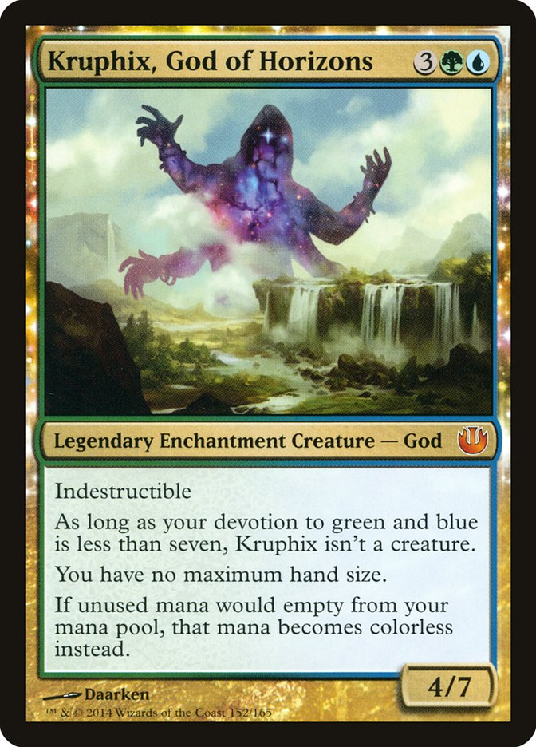

user Cases:
Ik wil als gebruiker, magic the gathering kaarten aan kunnen maken.

Ik wil als gebruiker, al mijn kaarten kunnen beheren.

Ik wil als gebruiker, kaarten van andere gebruikers kunnen kunnen raten met 1-5 sterren.

ik wil als gebruiker, mijn kaarten prive kunnen zetten.

ik wil als gebruiker, alle publieke kaarten kunnen filteren op kleur.

Ik wil als admin, kaarten kunnen beheren die gebruikers aan kunnen maken.

voorbeeld van een kaart voor context:

